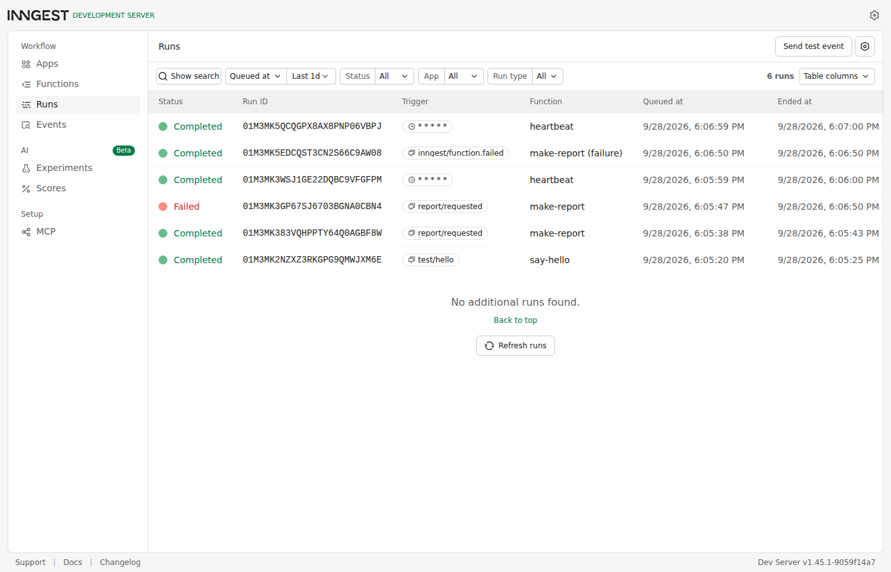
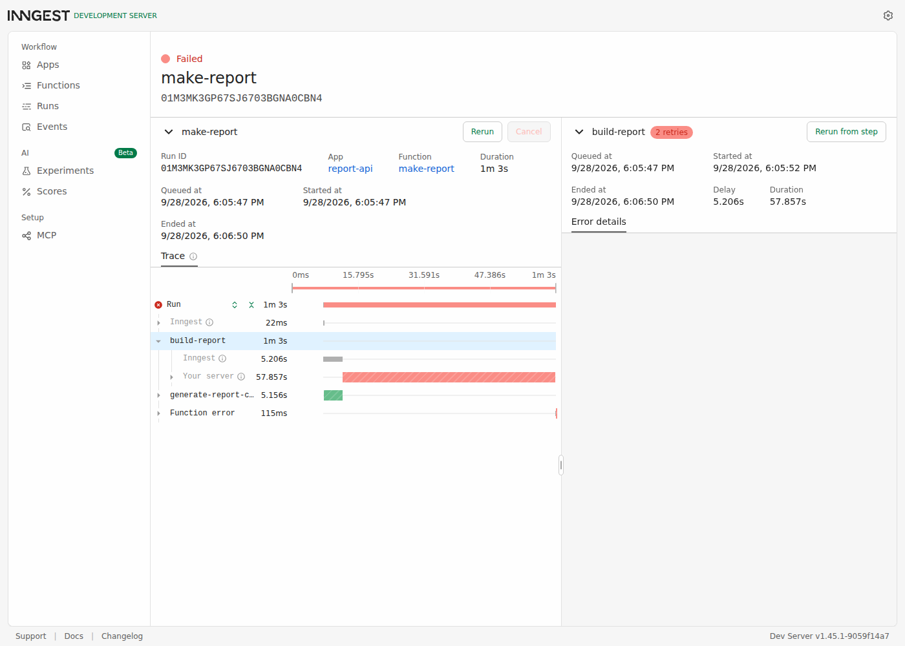

# first-background-job

Accept fast, work in the background, report status. A small report API
whose one slow operation — a real AI call — never runs inside a request.

This is FlyRank Internship Backend Track A7, "Your first background job."
Lane: **JavaScript** (Express + Inngest).

## Why this exists

Every "we'll email you when it's ready" you've ever seen is this pattern:
accept fast, work in the background, report status. The three
non-negotiables the assignment calls out are all here on purpose — jobs
run twice (idempotent steps), jobs fail (retries with backoff), and
someone has to find out (an `onFailure` alert).

## Run it (two terminals)

```bash
npm install
cp .env.example .env.local   # stub mode by default — no API key needed
npm start                     # terminal 1 — the API, on :3000
npm run inngest                # terminal 2 — the Inngest Dev Server, on :8288
```

Dashboard: `http://localhost:8288`.

Stub mode (`LLM_STUB=1`, the default) needs no OpenAI key — `make-report`'s
AI step returns a templated report after a realistic 3–6s delay, long
enough that polling actually observes `pending` before `done`. Set
`OPENAI_API_KEY` and `LLM_STUB=0` in `.env.local` to have it call a real
model instead; nothing else about the code changes.

## Endpoints & functions

| Method | Path | What it does |
|---|---|---|
| `GET` | `/health` | Stage 0 — liveness check. |
| `POST` | `/reports` | Stage 2 — `{ topic }` → `202 { id, status: "pending" }` in well under a second. Missing topic → `400`, no event sent. |
| `GET` | `/reports/:id` | Stage 2 — `pending` → `done` (+ result) or `failed` (+ error). Unknown id → `404`. |
| `GET` | `/reports` | Extra — lists every report (the "make it yours" control-panel endpoint). |
| `ALL` | `/api/inngest` | Where the Dev Server talks to this app. |

| Function | Trigger | Job |
|---|---|---|
| `say-hello` | event `test/hello` | Stage 1 — proves the wiring: sleeps 5s, returns a greeting. |
| `make-report` | event `report/requested` | Stages 2 & 3 — the real job (below). |
| `heartbeat` | cron `* * * * *` | Stage 4 — logs a `pending/done/failed` summary every minute. |

## `make-report`, and why it has two steps

```
step.run("generate-report-content", ...)   // the slow operation — a real AI call
step.run("build-report", ...)               // cheap: assemble + store the result
```

The assignment's own Stage 2 describes `step.sleep("do-the-slow-work",
"8s")` as "a stand-in for a real slow task (an AI call, a big export)." This
project uses the real thing instead of the stand-in — `generate-report-content`
actually calls an LLM (or, in stub mode, simulates one with a realistic
delay).

Splitting the AI call from the bookkeeping step isn't cosmetic — Inngest
memoizes finished steps. If `build-report` throws and the function retries,
`generate-report-content` is **not** re-run; the retry only re-pays for the
step that actually failed. You can see this directly in the dashboard
screenshot below: `generate-report-content` shows one 5.156s run, while
`build-report` shows `2 retries` next to it.

### Stage 3 — the fail path

`build-report` starts with one check: `if (topic === "fail") throw ...`.
Deliberately placed in the *second* step, not the first — a validation
failure and a processing failure are different things, and putting the
check after the (already-succeeded, already-memoized) AI call is what
makes the distinction visible in the trace.

The other half of Stage 3 is what does *not* retry: `POST /reports` with
no `topic` returns `400` and never calls `inngest.send(...)` at all — no
event, no run, nothing in the dashboard. A retry is for a job that was
accepted and then failed; a request that was never valid was rejected at
the door instead. That's the one-sentence distinction the assignment asks
for: **retries are for the wrong moment (a job failed after starting);
validation is for the wrong input (the request should never have started
at all)** — only the former gets retried.

### The alert

`make-report`'s config sets `onFailure`, which Inngest calls once retries
are exhausted (`retries: 2` → 3 total attempts). It marks the report
`failed` with the real error message and prints a clearly-tagged
`[ALERT]` line — a stand-in for what would actually page on-call or post
to Slack in a real system. This is the assignment's third non-negotiable:
jobs fail, and someone has to find out.

## Stage 4 — the cron schedule

`heartbeat` runs on `* * * * *` (every minute) for testing. The two real
schedules the assignment asks for, built on crontab.guru:

- **Every day at 08:00**: `0 8 * * *`
- **Every Sunday at 22:00**: `0 22 * * 0`

## Captured proof (real run against this repo)

```
$ time curl -s -X POST localhost:3000/reports -d '{"topic":"cats"}' -H 'Content-Type: application/json'
HTTP 202  (0.021s)
{"id":"602b37a1-7602-44ea-b965-051f93c87f8c","status":"pending"}

$ curl -s localhost:3000/reports/602b37a1-7602-44ea-b965-051f93c87f8c
# t+1s, t+2s: {"status":"pending", "result":null, ...}
# t+3s:
{"id":"602b37a1-...","topic":"cats","status":"done",
 "result":{"topic":"cats","content":"Report on \"cats\": the numbers are unremarkable this period — nothing needs attention. (stub mode...)","wordCount":25},
 "finishedAt":"2026-09-28T18:05:43.539Z"}

$ curl -s -X POST localhost:3000/reports -d '{}' -H 'Content-Type: application/json'
HTTP 400
{"error":"Body must include a non-empty string 'topic'."}
```

Dashboard, all three functions in one run list — `say-hello` completed,
`make-report` completed (the cats report), `make-report` **Failed** (the
fail-topic run), the `inngest/function.failed` alert handler completed
right after it, and two `heartbeat` runs exactly one minute apart:



The failed run's trace — `build-report` shows **2 retries**,
`generate-report-content` shows a single 5.156s run that was never
repeated:



## What's deliberately not here

No stretch goals in this pass (idempotency-on-duplicate-event, a
concurrency limit, the restart/durability proof, or the AI-rematch bonus
stage) — the 6 required stages are the full scope here. The in-memory
report store carries the same caveat as A1/A2 and the PDF-report
assignment: it's gone on restart, and it only works because Inngest runs
these functions inside this same Node process rather than a separate
worker — a real deployment would put it in a shared store both the API
and a standalone worker process could reach.

## Project structure

```
src/
  ai.js                       the slow operation — stub/real AI call toggle
  store.js                    in-memory report store
  server.js                   Stage 0/2 — Express routes
  inngest/
    client.js                 the Inngest client (id: report-api)
    functions/
      say-hello.js             Stage 1
      make-report.js           Stages 2 & 3 (+ onFailure alert)
      heartbeat.js             Stage 4
screenshots/
  dashboard-runs.png
  dashboard-failed-run.png
```

## Commit history

1. Stage 0 — hello server
2. Stage 1 — Inngest connected, say-hello runs
3. Stage 2 — 202 + background job + status endpoint (real AI call)
4. Stage 3 — retries, the fail path, and the alert
5. Stage 4 — cron heartbeat
6. Stage 5 — README + screenshots
